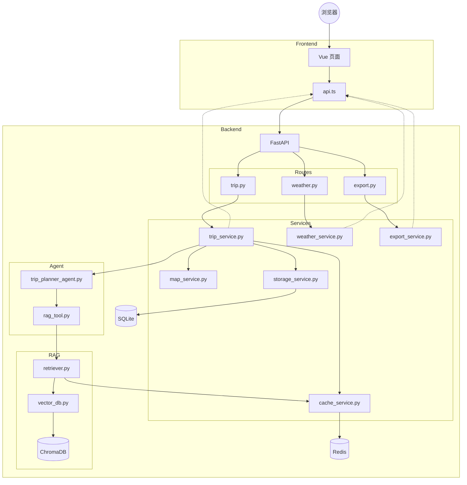
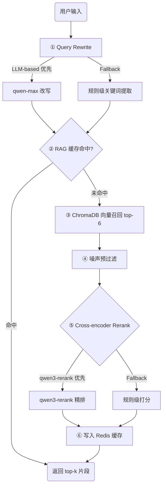
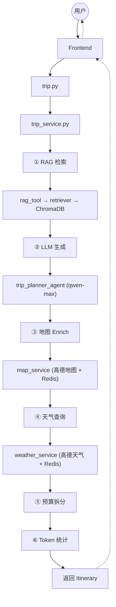

<div align="center">

# 🌍 智旅天下

**AI 驱动的全链路智能旅行规划系统**

基于 LLM + RAG + 地图服务的旅行方案自动生成平台，覆盖行程编排、攻略检索增强、地图点位补全、天气感知、预算拆分、历史管理与文档导出完整闭环。

[](https://www.python.org/)
[](https://fastapi.tiangolo.com/)
[](https://vuejs.org/)
[](LICENSE)

</div>

---

## 目录

- [系统概览](#系统概览)
- [技术架构](#技术架构)
- [数据流全景](#数据流全景)
- [RAG 检索管线](#rag-检索管线)
- [项目代码结构](#项目代码结构)
- [接口文档](#接口文档)
- [存储与缓存设计](#存储与缓存设计)
- [环境配置](#环境配置)
- [快速启动](#快速启动)
- [RAG 数据初始化](#rag-数据初始化)
- [测试与验证](#测试与验证)
- [核心业务流程](#核心业务流程)
- [效果展示](#效果展示)

---

## 系统概览

智旅天下是一个面向中文旅行场景的 AI 旅行规划系统。用户输入目的地、日期、预算、人数和偏好后，系统自动生成结构化旅行方案，并进一步补全地图点位、天气信息、预算拆分、景点图片与可导出的旅行文档。

与仅输出一段文本的 LLM Demo 不同，本项目的核心设计目标是将 AI 能力组织成一个**可交互、可保存、可导出**的产品级原型：

```
用户输入 → Query Rewrite → RAG 攻略检索 → Rerank 精排 → LLM 结构化生成 → 地图 Enrich → 天气补全 → 预算拆分 → 前端展示 → 保存/编辑/导出
```

### 核心能力矩阵

| 能力 | 实现方式 | 说明 |
|:---|:---|:---|
| 行程生成 | LangChain + qwen-max | 结构化 JSON 输出，Pydantic 校验 |
| 攻略增强 | ChromaDB + RAG | 本地攻略向量检索 + LLM 改写 + Cross-encoder 精排 |
| 地图补全 | 高德 Web 服务 | POI 搜索、地理编码、路线估算、景点图片 |
| 天气感知 | 高德天气 API | 前端展示 + 雨天/阴天自动修正提示 |
| 缓存加速 | Redis | 天气/地图/RAG/Rerank 多层缓存 |
| 行程编辑 | LLM 单日重写 | 自然语言修改 + 地图重新 Enrich |
| 文档导出 | Jinja2 + ReportLab | Markdown / 中文 PDF 双格式 |
| Token 观测 | 分项统计 | Query Rewrite / Embedding / Rerank / Planner 独立计量 |

---

## 技术架构

### 技术栈

| 层级 | 技术选型 | 用途 |
|:---|:---|:---|
| 前端 | Vue 3 + Vite + TypeScript | 规划页 / 结果页 / 历史页 + 高德地图组件 |
| 接口层 | FastAPI + Pydantic | 路由定义、请求校验、响应序列化 |
| Agent 层 | LangChain + qwen-max | 行程生成、单日编辑、Query Rewrite |
| RAG 层 | ChromaDB + text-embedding-v4 + qwen3-rerank | 向量召回 + 语义精排 |
| 服务层 | 自研 Service 编排 | 行程编排、地图 Enrich、天气、缓存、导出、存储 |
| 持久化 | SQLAlchemy + SQLite | 行程记录 CRUD |
| 缓存 | Redis | 高频查询结果缓存与降级 |

### 分层架构图

```
┌─────────────────────────────────────────────────────────────┐
│                        Frontend                              │
│   Home.vue (规划)  ·  Result.vue (结果)  ·  History.vue (历史) │
│              AmapTripMap.vue (地图组件)                       │
└──────────────────────────┬──────────────────────────────────┘
                           │ Axios
                           ▼
┌─────────────────────────────────────────────────────────────┐
│                      API Routes                              │
│   trip.py  ·  export.py  ·  weather.py                      │
└──────────────────────────┬──────────────────────────────────┘
                           │
                           ▼
┌─────────────────────────────────────────────────────────────┐
│                    Service 编排层                             │
│  trip_service ──► cache_service (Redis 读写/降级)            │
│       │                                                      │
│       ├──► map_service (地理编码/POI/路线/图片 + Redis 缓存)  │
│       ├──► weather_service (天气查询 + Redis 缓存)            │
│       ├──► storage_service (SQLite 持久化)                    │
│       └──► export_service (Markdown / PDF 渲染)               │
└──────────────────────────┬──────────────────────────────────┘
                           │
              ┌────────────┼────────────┐
              ▼                         ▼
┌──────────────────────┐   ┌─────────────────────────┐
│   Agent 层           │   │      RAG 层              │
│  trip_planner_agent  │   │  rag_tool (Query Rewrite)│
│  (qwen-max 生成)     │◄──│  retriever (向量召回+精排)│
│                      │   │  vector_db (ChromaDB)    │
└──────────────────────┘   └─────────────────────────┘
```

---

## 数据流全景



**端到端数据流路径：**

```
用户输入（目的地/日期/预算/偏好）
  → 前端收集并发起 POST /trip/generate
  → 后端 trip_service 编排：
      ① rag_tool: Query Rewrite → 向量检索 → Rerank 精排 → 返回 top-k 攻略片段
      ② trip_planner_agent: 攻略片段 + 用户输入 → qwen-max 生成结构化行程
      ③ map_service: 逐景点查 POI/坐标/路线/图片（每步 Redis 缓存）
      ④ weather_service: 天气预报（Redis 缓存）
      ⑤ 预算拆分计算
      ⑥ Token 消耗统计
  → 返回 Itinerary JSON → 前端展示地图/天气/预算/每日行程
  → 用户可保存/编辑/导出
```

---

## RAG 检索管线

### 离线阶段


- 攻略文档按标题切块，生成 49 个片段
- 使用 DashScope `text-embedding-v4` 生成向量
- 写入 ChromaDB 持久化存储，只需执行一次

### 在线阶段



**在线阶段 7 步详解：**

| 步骤 | 操作 | 模型/方法 | 说明 |
|:---|:---|:---|:---|
| ① Query Rewrite | 检索词改写 | qwen-max / 规则 fallback | 将用户自然语言转为高效检索关键词 |
| ② 缓存检查 | RAG 缓存命中判断 | Redis | 命中则直接返回，跳过 ③-⑥ |
| ③ 向量召回 | 语义相似度检索 | ChromaDB + text-embedding-v4 | 召回 top-6 候选片段 |
| ④ 噪声预过滤 | 去低信息量片段 | 规则判断 | 避免浪费 Rerank API 调用 |
| ⑤ Cross-encoder Rerank | 语义级精排 | qwen3-rerank / 规则 fallback | 输出 top-3 最相关片段 |
| ⑥ 缓存写入 | 结果缓存 | Redis | RAG 缓存 + Rerank 缓存双写 |
| ⑦ 返回结果 | 组装上下文 | - | top-k 文本送入 LLM prompt |

### RAG 优化效果

| 优化阶段 | Top1 命中率 | MRR | Avg Latency |
|:---|:---|:---|:---|
| 基线（纯向量检索） | 80.0% | 0.889 | - |
| + 规则级 Query Rewrite | 86.7% | 0.922 | - |
| + LLM-based Query Rewrite | 86.7% | 0.922 | - |
| + Cross-encoder Rerank | **93.3%** | **0.967** | - |
| + Rerank 缓存命中 | 93.3% | 0.967 | **425ms**（↓41.6%） |

---

## 项目代码结构

```
ZhiLvTianXia/
├── backend/
│   ├── app/
│   │   ├── config.py                        # 环境变量、数据库 Base、全局配置
│   │   ├── agents/
│   │   │   ├── trip_planner_agent.py        # LLM 行程生成 + 单日编辑
│   │   │   └── tools/
│   │   │       └── rag_tool.py              # Query Rewrite（LLM + 规则 fallback）
│   │   ├── api/
│   │   │   ├── main.py                      # FastAPI 应用入口
│   │   │   └── routes/
│   │   │       ├── trip.py                  # 行程 CRUD + 生成/编辑
│   │   │       ├── export.py                # Markdown / PDF 导出
│   │   │       └── weather.py               # 天气预报
│   │   ├── models/
│   │   │   ├── schemas.py                   # Pydantic 请求/响应/itinerary 模型
│   │   │   └── db_models.py                 # SQLAlchemy 表定义
│   │   ├── rag/
│   │   │   ├── vector_db.py                 # Markdown 切片 + Chroma 入库检索
│   │   │   └── retriever.py                 # 检索封装 + RAG 缓存 + Rerank
│   │   └── services/
│   │       ├── trip_service.py              # 行程主编排 + 预算 + 地图 Enrich
│   │       ├── cache_service.py             # Redis 缓存封装 + 降级
│   │       ├── map_service.py               # 高德 POI/地理编码/路线/图片
│   │       ├── weather_service.py           # 高德天气服务
│   │       ├── storage_service.py           # SQLite CRUD
│   │       └── export_service.py            # Markdown / PDF 渲染
│   ├── data/                                # 本地攻略 Markdown 文档
│   ├── eval/                                # RAG 评估样例集
│   ├── scripts/                             # 入库/调试/评估/测试脚本
│   ├── tests/                               # pytest 测试
│   ├── .env.example                         # 后端环境变量模板
│   └── requirements.txt
├── frontend/
│   ├── src/
│   │   ├── services/
│   │   │   └── api.ts                       # Axios 封装 + API 调用
│   │   ├── types/
│   │   │   └── index.ts                     # TypeScript 类型定义
│   │   ├── views/
│   │   │   ├── Home.vue                     # 规划页
│   │   │   ├── Result.vue                   # 结果展示页
│   │   │   └── History.vue                  # 历史列表页
│   │   ├── components/
│   │   │   └── AmapTripMap.vue              # 地图可视化组件
│   │   ├── App.vue
│   │   └── main.ts
│   ├── .env.example
│   └── package.json
├── assets/showcase/                         # README 展示截图
├── CHANGELOG.md
├── .gitignore
└── README.md
```

### 关键文件职责速查

| 文件 | 职责 |
|:---|:---|
| `trip_service.py` | 行程主编排：天数拆分 → 预算估算 → 地图 Enrich → 统一刷新 |
| `cache_service.py` | Redis 懒加载 + JSON 缓存读写 + Redis 不可用时优雅降级 |
| `trip_planner_agent.py` | qwen-max 结构化生成 + 单日编辑 LLM 输出处理 |
| `rag_tool.py` | Query Rewrite：LLM 优先 → 规则 fallback |
| `retriever.py` | 向量召回 + RAG 缓存 + Cross-encoder Rerank + Rerank 缓存 |
| `vector_db.py` | Markdown 按标题切块 → text-embedding-v4 → ChromaDB 入库 |
| `map_service.py` | 高德地理编码 → POI 搜索 → 路线估算 → 图片补充（每步 Redis 缓存） |
| `export_service.py` | Jinja2 渲染 Markdown + ReportLab 生成中文 PDF |
| `storage_service.py` | SQLAlchemy + SQLite 行程 CRUD |
| `schemas.py` | Pydantic 模型定义：请求体、响应体、Itinerary 结构 |
| `db_models.py` | TripRecord 表定义：trip_id / destination / itinerary_json / created_at |
| `debug_rag_retrieval.py` | RAG 调试：输出 query / top-k 片段 / rerank_score / rerank_reasons |
| `evaluate_rag_retrieval.py` | RAG 评估：Top1/TopK 命中率 / MRR / Noise Rate / Latency / 跨目的地污染 |

---

## 接口文档

### 行程接口

#### `POST /trip/generate` — 生成行程

**请求体：**

```json
{
  "destination": "大理",
  "start_date": "2026-06-01",
  "end_date": "2026-06-04",
  "budget": 5000,
  "num_people": 2,
  "preferences": "自然风光、拍照",
  "pace": "relaxed",
  "notes": "不想去人多的地方"
}
```

**响应体（核心字段）：**

```json
{
  "code": 200,
  "data": {
    "destination": "大理",
    "summary": "...",
    "days": [
      {
        "day_index": 1,
        "theme": "古城漫步与洱海日出",
        "spots": [
          {
            "name": "大理古城",
            "address": "云南省大理白族自治州...",
            "latitude": 25.6065,
            "longitude": 100.2675,
            "poi_id": "B0FF...",
            "description": "...",
            "image_url": "https://..."
          }
        ],
        "meals": { "breakfast": "...", "lunch": "...", "dinner": "..." },
        "notes": "...",
        "route": { "total_distance": "15km", "total_duration": "2h" }
      }
    ],
    "budget_breakdown": {
      "total": 5000,
      "transport": 800,
      "accommodation": 1500,
      "food": 1200,
      "tickets": 500,
      "other": 1000,
      "daily": [
        { "day": 1, "amount": 1500 },
        { "day": 2, "amount": 1200 }
      ]
    },
    "weather": [...],
    "tips": "...",
    "token_usage": {
      "query_rewrite": { "prompt": 120, "completion": 45, "total": 165 },
      "embedding": { "prompt": 80, "total": 80 },
      "rerank": { "prompt": 200, "completion": 60, "total": 260 },
      "planner": { "prompt": 1500, "completion": 800, "total": 2300 },
      "total_tokens": 2805
    }
  }
}
```

#### `POST /trip/edit` — 智能编辑

```json
{
  "itinerary": { ... },
  "edit_instruction": "第二天换成去苍山",
  "edit_scope": "day",
  "day_index": 2
}
```

#### `POST /trip/save` — 保存行程

```json
{
  "itinerary": { ... }
}
```

#### `GET /trip` — 历史列表

返回所有已保存行程的摘要列表。

#### `GET /trip/{trip_id}` — 行程详情

返回指定行程的完整 itinerary JSON。

#### `DELETE /trip/{trip_id}` — 删除行程

#### `GET /trip/stats` — Token 消耗统计

返回已保存行程的 token 消耗汇总。

### 导出接口

| 方法 | 路径 | 说明 | 返回格式 |
|:---|:---|:---|:---|
| `GET` | `/export/{trip_id}/markdown` | 导出 Markdown | `text/markdown` |
| `GET` | `/export/{trip_id}/pdf` | 导出 PDF | `application/pdf` |

### 天气接口

#### `GET /weather/forecast?city=大理&start_date=2026-06-01&end_date=2026-06-04`

返回指定城市、日期范围的天气预报，支持 Redis 缓存。

### 基础接口

| 方法 | 路径 | 说明 |
|:---|:---|:---|
| `GET` | `/` | 服务启动检查 |
| `GET` | `/health` | 健康检查 |

---

## 存储与缓存设计

系统采用 SQLite + Redis 双存储架构，职责分明：

```
┌───────────────────────────────────────────────┐
│                 用户请求                        │
│                    │                           │
│         ┌─────────┴─────────┐                 │
│         ▼                   ▼                 │
│   ┌──────────┐        ┌──────────┐            │
│   │  Redis   │        │  SQLite  │            │
│   │ 短期缓存 │        │ 长期持久 │            │
│   └──────────┘        └──────────┘            │
│         │                   │                 │
│    天气/地图/RAG        行程记录 CRUD          │
│    /Rerank 结果        (TripRecord 表)         │
│    TTL 自动过期        长期保留可查询           │
└───────────────────────────────────────────────┘
```

### SQLite — 持久化存储

- **实现**：`db_models.py` 定义 `TripRecord` 表，`storage_service.py` 封装 CRUD
- **核心字段**：`trip_id` / `destination` / `summary` / `itinerary_json` / `created_at` / `updated_at`
- **设计理由**：旅行方案属于用户主动保存的业务数据，需长期保留、可查询、可删除；SQLite 轻量部署，适合个人项目与 Demo

### Redis — 缓存加速

- **实现**：`cache_service.py` 统一封装，被 `weather_service` / `map_service` / `retriever` 复用
- **缓存分层**：

| 缓存类型 | Key 模式 | TTL | 作用 |
|:---|:---|:---|:---|
| 天气缓存 | `trip_planner:weather:{city}:{date}` | 30min | 避免重复调用高德天气 API |
| 地图缓存 | `trip_planner:map:{type}:{query}` | 24h | 地理编码/POI/路线结果复用 |
| RAG 缓存 | `trip_planner:rag:{query_hash}` | 6h | 相同检索词直接返回 top-k |
| Rerank 缓存 | `trip_planner:rerank:{query_hash}:{docs_hash}` | 6h | 避免重复 Rerank API 调用 |

- **降级策略**：Redis 不可用时自动跳过缓存，直接调用外部服务，不影响主流程

---

## 环境配置

### 后端 `backend/.env`

```env
# ── LLM ──
LLM_PROVIDER=openai_compatible
LLM_API_KEY=your_dashscope_api_key
LLM_MODEL=qwen-max
LLM_BASE_URL=https://dashscope.aliyuncs.com/compatible-mode/v1
LLM_TIMEOUT_SECONDS=60
LLM_MAX_RETRIES=1

# ── RAG / 向量库 ──
CHROMA_DB_DIR=db/chroma_db
CHROMA_COLLECTION_NAME=travel_guides
EMBEDDING_MODEL=text-embedding-v4
EMBEDDING_BATCH_SIZE=10
RERANK_MODEL=qwen3-rerank

# ── Redis 缓存 ──
REDIS_ENABLED=false
REDIS_URL=redis://127.0.0.1:6379/0
REDIS_KEY_PREFIX=trip_planner
REDIS_DEFAULT_TTL_SECONDS=1800
REDIS_WEATHER_TTL_SECONDS=1800
REDIS_MAP_TTL_SECONDS=86400
REDIS_RAG_TTL_SECONDS=21600
REDIS_RERANK_TTL_SECONDS=21600

# ── 高德地图 ──
AMAP_API_KEY=your_amap_web_service_key
AMAP_BASE_URL=https://restapi.amap.com/v3
AMAP_DEFAULT_CITY=
AMAP_TIMEOUT_SECONDS=20
ENABLE_AMAP_ENRICHMENT=true
```

### 前端 `frontend/.env`

```env
VITE_API_BASE_URL=http://你的服务器地址:8000
VITE_AMAP_JS_KEY=your_amap_javascript_api_key
```

> ⚠️ 高德后端 Key（Web 服务）和前端 Key（JavaScript API）是不同的，不要混用。

---

## 快速启动

### 1. 启动 Redis（可选，推荐开启缓存）

```bash
# 首次
docker run -d --name tripplanner-redis -p 6379:6379 redis:7

# 后续
docker start tripplanner-redis
```

在 `backend/.env` 中设置 `REDIS_ENABLED=true`。

### 2. 启动后端

```bash
cd backend
pip install -r requirements.txt
# 复制 .env.example → .env，填写配置
uvicorn app.api.main:app --host 0.0.0.0 --port 8000
```

访问 `http://127.0.0.1:8000/docs` 查看 Swagger 文档。

### 3. 启动前端

```bash
cd frontend
npm install
# 复制 .env.example → .env，填写配置
npm run dev
```

访问 `http://127.0.0.1:5173`。

---

## RAG 数据初始化

首次使用前必须执行入库脚本：

```bash
cd backend
python scripts/ingest_data.py
```

成功后输出 `written_count: 9`（5 个目的地共 49 个片段入库到 ChromaDB）。

---

## 测试与验证

```bash
# 后端 API 测试
cd backend && pytest tests/test_api_trip.py -q

# 高德服务验证
cd backend/scripts && python test_map_service.py

# 真实行程生成测试
cd backend/scripts && python test_trip_service_real.py
```

---

## 核心业务流程

### 行程生成流程



### 智能编辑流程

```
POST /trip/edit
  → trip_service.py
    → ① 定位目标 DayPlan（edit_scope 解析 day_index）
    → ② trip_planner_agent.generate_day_edit_draft（LLM 单日重写）
       └─ 失败时 fallback 到规则编辑（关键词匹配）
    → ③ 替换目标 DayPlan（theme / spots / meals / notes）
    → ④ map_service 重新 Enrich（清旧坐标，重新查 POI/路线/图片）
    → ⑤ 更新 tips 和 source_notes
  → 返回更新后的 Itinerary
```

### 保存与导出流程

```
POST /trip/save     → storage_service → SQLite 持久化

GET /export/{id}/markdown → storage_service 读取 → export_service Jinja2 渲染

GET /export/{id}/pdf      → storage_service 读取 → export_service ReportLab 生成
                          → Content-Disposition 返回（RFC 编码兼容中文文件名）
```

---

## 效果展示

| 规划页 | 行程生成结果 |
|:---:|:---:|
|  |  |

| 保存与历史 | PDF 导出 |
|:---:|:---:|
|  |  |

---


| MCP 工具化 | 🚧 规划中 | 地图/天气/搜索能力抽成 MCP，跨 Agent 复用 |
| 真实商户信息 | 🚧 规划中 | 接入高德 POI 详情/大众点评，卡片式展示 |
| PDF 导出优化 | 🚧 规划中 | 分栏布局、中文字体、景点图片、天气图标 |
| 质量评估体系 | 🚧 规划中 | 结构完整性/预算合理性/偏好满足度量化 |
